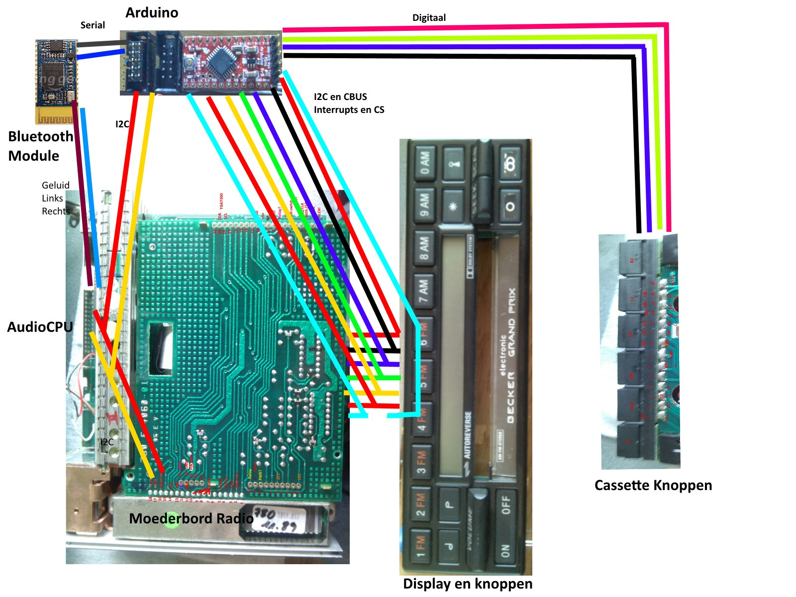

Becker 780 BE0780 car radio with Bluetooth 

I am Roland Wiersma from the Netherlands alias SuperCow.
In the last 10 years I’ve done some fun projects with an Arduino.
I have made some libraries for it, Lego Power function Sender and receiver, ATTiny84 core and ATCAN128 with fully CAN-bus support for the Arduino.

This project is about car radio from the 80's the Becker 780.
The idea is to add modern functionality, an Bluetooth connection to a smartphone.
But keeping all existing radio function, the FM, AM and cassette player.

With the Bluetooth, using de HFP and A2DP profiles it is possible to stream music and using car-kit hands free calling.

After 4 years I decided to continue with this project. 
Using an Arduino mini to glue the logic.
The last thing, I had trouble with the Bluetooth module, that’s where I have to start from again.
I made back then a demonstration: https://www.youtube.com/watch?v=7wbGRcMYx9w 

I have an tendency to MIA, so I I’ll try GitHub to make my code public.
The code now publisted is back from 2014, its really dirty in alpha stage.

<<<<<<< HEAD

=======

>>>>>>> ba9dae3821b3ee09db45e360b20709744b4aa76a
